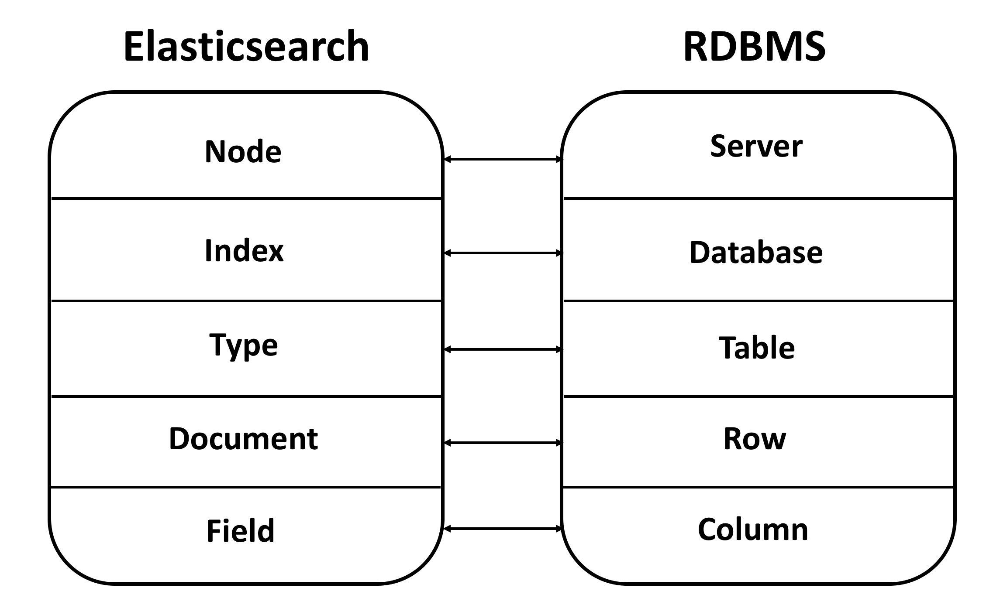
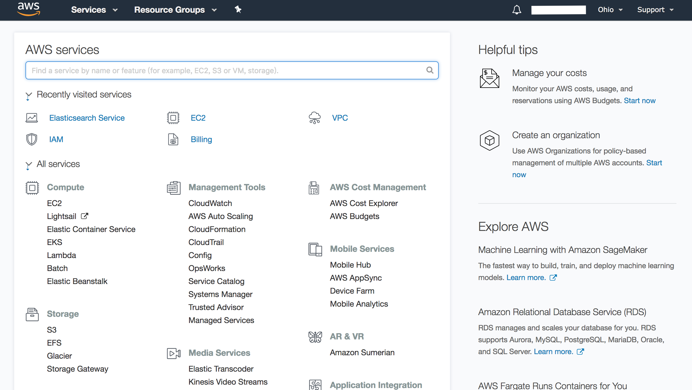

# AWS Elasticsearch

## Introduction

近年來，儲存容量性能的大幅增加、各種感測技術的精進，大數據、物聯網、人工智慧等風潮在近年來可說是水漲船高，那麼你我皆處在這世代中，相信一定都有聽過所謂的分散式運算，而Elasticsearch便是一種分散式儲存系統。

試想，在日誌分析的應用下，資料累積的速度肯定是非常地快的，但若是依賴於RDBMS\(關聯式資料庫管理系統\)，若要取出資料進行分析或進行資料搜索的話，肯定是要不小的時間成本的。

而分散式儲存系統的作用就在此展現了，其架構通常為由數以千計的叢集\(Cluster\)組成，而每個叢集又由很多節點組成，當一個資料進來時，會將其進行切割，並分別放置於不同節點中，以NoSql風格進行儲存，同時亦會將這些資料塊建立副本。如此做的好處，除了可直接hash到我們所想要的資料，亦可保證資料的安全性與資料庫的易擴展性。

而Elasticsearch便是這麼一個樣的分散式儲存系統，相對於RDBMS，他以NoSQL的方式提供索引，其與RDBMS的對應如下圖。

## AWS Elasticsearch

Elasticsearch目前在搜尋引擎領域中已舉世聞名，是一種開源的Restful風格的數據搜尋、分析引擎，各大知名廠商與組織都是使用Elastcisearch來實現搜尋功能，如Stackoverflow、維基百科等等，其中Amazon、Microsoft等更是開放出API接口，讓我們可以輕鬆地獲取他們的Elastcisearch資源。那麼在這篇，就要來帶大家一步步如何佈建出一個AWS Elasticsearch叢集。

### Step 1 創建帳戶

首先，請先移至[https://aws.amazon.com/tw](https://aws.amazon.com/tw) ，並申請一個開發者帳號，這應該不用多說，用力創下去就對了。

### Step2 創建AWS Elasticsearch Domain

當你登入你的開發者帳號後，你可以看到一個儀表板\(Dashboard\)，你可以任意點選你所要的AWS Service來獲得服務。

其中你可以在Dashboard的右上角看到Ohio，這是代表目前你所選擇的區域，AWS將其資源服務分為好幾個地理區域，稱為區域，彼此獨立。而一個區域亦可分為好幾個可用區，彼此是相互隔離的。

那麼當你已成功看到Dashboard時，並點選Elasticsearch Service，進入後點選create domain即可開始我們ES Domain的創建。

> 注意：這是你在Dashboard所選擇的地區，會成為你ES Domain所屬的地區。

#### Define a domain

這裡應該不用多講，就填寫你的域名和你所想要的Elasticsearch版本。

#### Node Configuration

Elasticsearch是由許多節點所組成，而每個節點又有許多分片\(Shards\)，其會將輸入資料進行切割，並儲存至各個分片中。

那麼這時，我們要先進行節點的配置，原則上，節點的數量是依照你的需求進行配置，在這邊先不用急，我們在後面會提供AWS所建議的公式來進行節點數的計算。

同時，我們還可以去定義節點的種類，有些是運算優化、有些是儲存優化等等，同樣地節點的種類也是依照你的需求而定。

#### Dedicated master node \(optional\)

而當你的節點配置數量超過10個以上，AWS官方文件會建議你配置Dedicated master node，這種節點不會作為數據儲存之用，而是用來作為穩定叢集之用。

> 注意：Dedicated master node建議數量為奇數，避免會有分裂大腦問題。  
> 因為設置為1時，當一個節點掛掉，無法立即遞補而會導致系統停擺。  
> 而設置為2時，當一個節點掛掉，就不會有節點來做為備份之用。

當然，你也可以為Dedicated master node和普通的instance node選擇不同的節點類型。

#### Zone awareness \(optional\)

Zone awareness\(區域感知\)是一種提高數據持久性的技術，其將節點在同一區域的不同可用區進行部署，但這也意味著你必須部署偶數數量的Instance，如此才可在兩個可用區平均分配Instance。

區域感知要求每個資料都必須有一個副本，主成本分片與副本分片會在不同可用區間的各節點分佈，如此來提高數據的可用性與持久性。

> 注意：若啟用Zone awareness，則必須佈建本地Elasticsearch建立副本。

> 注意：若使用VPC與區域感知，則必須為VPC的子網指定可用區。

#### Storage type

此設定為為你的Instance選擇儲存容量的大小與儲存硬體種類。其中儲存硬體種類分為EBS\(預設\)和SSD等等，而這些一樣是依你的需求來進行配置。

#### 靜態數據加密\(Optional\)

此技術是讓你防止人們未經授權訪問你的資料，其使用AWS Key Management Service \(KMS\) 來儲存和管理您的加密密鑰。當你決定使用此項技術時，可讓AWS 來為你的數據創建KMS加密密鑰或使用你自己創建的KMS加密密鑰。

此技術會對你的數據、自動快照、日誌、索引等進行加密，提升安全性，但對於手動快照、慢速日誌不會自動為其加密。

#### Snapshot configuration

配置你要固定在何時進行快照備份。

#### 

