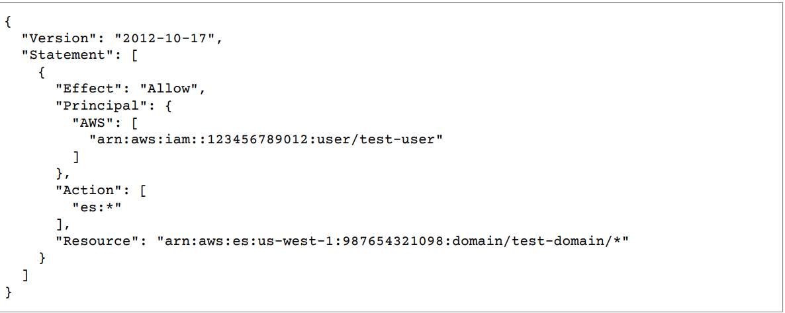

# AWS Elasticsearch

## Introduction

近年來，儲存容量性能的大幅增加、各種感測技術的精進，大數據、物聯網、人工智慧等風潮在近年來可說是水漲船高，那麼你我皆處在這世代中，相信一定都有聽過所謂的分散式運算，而Elasticsearch便是一種分散式儲存系統。

試想，在日誌分析的應用下，資料累積的速度肯定是非常地快的，但若是依賴於RDBMS\(關聯式資料庫管理系統\)，若要取出資料進行分析或進行資料搜索的話，肯定是要不小的時間成本的。

而分散式儲存系統的作用就在此展現了，其架構通常為由數以千計的叢集\(Cluster\)組成，而每個叢集又由很多節點組成，當一個資料進來時，會將其進行切割，並分別放置於不同節點中，以NoSql風格進行儲存，同時亦會將這些資料塊建立副本。如此做的好處，除了可直接hash到我們所想要的資料，亦可保證資料的安全性與資料庫的易擴展性。

而Elasticsearch便是這麼一個樣的分散式儲存系統，相對於RDBMS，他以NoSQL的方式提供索引，其與RDBMS的對應如下圖。


## AWS Elasticsearch

Elasticsearch目前在搜尋引擎領域中已舉世聞名，是一種開源的Restful風格的數據搜尋、分析引擎，各大知名廠商與組織都是使用Elastcisearch來實現搜尋功能，如Stackoverflow、維基百科等等，其中Amazon、Microsoft等更是開放出API接口，讓我們可以輕鬆地獲取他們的Elastcisearch資源。那麼在這篇，就要來帶大家一步步如何佈建出一個AWS Elasticsearch叢集。

### Step 1 創建帳戶

首先，請先移至[https://aws.amazon.com/tw](https://aws.amazon.com/tw) ，並申請一個開發者帳號，這應該不用多說，用力創下去就對了。

### Step2 創建AWS Elasticsearch Domain

當你登入你的開發者帳號後，你可以看到一個儀表板\(Dashboard\)，你可以任意點選你所要的AWS Service來獲得服務。


其中你可以在Dashboard的右上角看到Ohio，這是代表目前你所選擇的區域，AWS將其資源服務分為好幾個地理區域，稱為區域，彼此獨立。而一個區域亦可分為好幾個可用區，彼此是相互隔離的。

那麼當你已成功看到Dashboard時，並點選Elasticsearch Service，進入後點選create domain即可開始我們ES Domain的創建。

> 注意：這是你在Dashboard所選擇的地區，會成為你ES Domain所屬的地區。

#### Define a domain

這裡應該不用多講，就填寫你的域名和你所想要的Elasticsearch版本。

### Step 3 Configuration Cluster

#### Node Configuration

Elasticsearch是由許多節點所組成，而每個節點又有許多分片\(Shards\)，其會將輸入資料進行切割，並儲存至各個分片中。

那麼這時，我們要先進行節點的配置，原則上，節點的數量是依照你的需求進行配置，在這邊先不用急，我們在後面會提供AWS所建議的公式來進行節點數的計算。

同時，我們還可以去定義節點的種類，有些是運算優化、有些是儲存優化等等，同樣地節點的種類也是依照你的需求而定。


#### 配置：因為只是練習，所以只需把Instance count設為1，種類設為t2.small.elasticsearch，因為這樣才不會被收費哈哈。

#### Dedicated master node \(optional\)

而當你的節點配置數量超過10個以上，AWS官方文件會建議你配置Dedicated master node，這種節點不會作為數據儲存之用，而是用來作為穩定叢集之用。

> 注意：Dedicated master node建議數量為奇數，避免會有分裂大腦問題。  
> 因為設置為1時，當一個節點掛掉，無法立即遞補而會導致系統停擺。  
> 而設置為2時，當一個節點掛掉，就不會有節點來做為備份之用。

當然，你也可以為Dedicated master node和普通的instance node選擇不同的節點類型。

#### 配置：不啟用

#### Zone awareness \(optional\)

Zone awareness\(區域感知\)是一種提高數據持久性的技術，其將節點在同一區域的不同可用區進行部署，但這也意味著你必須部署偶數數量的Instance，如此才可在兩個可用區平均分配Instance。

區域感知要求每個資料都必須有一個副本，主成本分片與副本分片會在不同可用區間的各節點分佈，如此來提高數據的可用性與持久性。

> 注意：若啟用Zone awareness，則必須佈建本地Elasticsearch建立副本。

> 注意：若使用VPC與區域感知，則必須為VPC的子網指定可用區。

#### 配置：不啟用

#### Storage Configuration

此設定為為你的Instance選擇儲存容量的大小與儲存硬體種類、儲存方式種類。其中儲存硬體種類分為EBS\(預設\)和SSD等等，而這些一樣是依你的需求來進行配置。

#### 配置：Storage Type選擇EBS，EBS Volume Type選擇General Purpose SSD，EBS Volume Size選擇10，原因一樣因為不會被收費ＸＤ。

#### 靜態數據加密\(Optional\)

此技術是讓你防止人們未經授權訪問你的資料，其使用AWS Key Management Service \(KMS\) 來儲存和管理您的加密密鑰。當你決定使用此項技術時，可讓AWS 來為你的數據創建KMS加密密鑰或使用你自己創建的KMS加密密鑰。

此技術會對你的數據、自動快照、日誌、索引等進行加密，提升安全性，但對於手動快照、慢速日誌不會自動為其加密。

#### 配置：目前不啟用。

#### Snapshot configuration

配置你要固定在何時進行快照備份。


#### 配置：設置為預設時間即可。

### Step 4 Setup Access

#### Network Configuration

在這邊你可以選擇Public Access和VPC Access。  
  
VPC Access  
若選擇VPC Access，則要選擇VPC 的 ID，\(VPC 的創建一樣可在Dashboard中找到\)，但必須確保VPC和ES Domain是在同一個區域，且僅能選擇defaul配置的VPC，因為目前AWS尚無支援專用租賃的VPC。  
而對於子網的配置，若有啟動Zone awareness，則必須指定兩個子網。AWS會將VPC 終端節點和彈性網路接口放置於子網中。

> 注意：要為子網預留足夠的IP位址，這個IP位址數，AWS一樣有提供公式為你所配置的節點數\*3，但要注意的是，若啟用區域感知，則公式變為\(節點數/2\)\*3。

接著就是配置可訪問此VPC的安全組，安全組可在IAM中進行配置。

> Note：因在本文教學中，所採用的基於IP的訪問策略，不能使用VPC配置，所以在VPC配置中並無太多著墨，有興趣者可至AWS的官方文件深入了解。

Public Access可使用公網來進行訪問，但我們可以利用一些技巧來管控特定人才能進行訪問。

#### 配置：Public Access

#### Kibana authentication

AWS提供AWS Cognito來讓特定人可訪問Kibana介面。但在這邊我們所使用的技巧是透過反向代理伺服器搭配基於IP的策略來建構我們的服務。因此這邊也不多加著墨，有興趣者可直接參閱AWS官方文件。

#### 配置：不啟用

#### Access Policy

這個配置是非常重要的，他可以決定你要如何控管誰可以訪問所創建的Elasticsearch叢集，有三種策略。

在介紹這三種策略前，先帶大家來認識AWS Elasticsearch Policy的編寫語法。  
Statement：是一個JSON格式，其可包覆好幾個配置邏輯。  
Effect：分為Allow與Deny，分別代表允許或拒絕。  
Principal：代表指定的帳戶與角色。  
Action：代表動作，有es:ESHttpDelete、es:ESHttpGet、es:ESHttpPost等，分別對Elasticsearch叢集刪除、get、post。  
Resource：代表的是Elasticsearch叢集哪一個資源。

> 假設我的域名為aaa，則資源的編寫可為arn:aws:ARN ID:domain/aaa/\*，後面有沒有加一個\*非常重要，這代表著此elasticsearch叢集的所有索引，而非elasticsearch叢集本身，若不加\*，則代表可對該叢集配置進行改動。

1. 基於資源的策略 此策略可指定哪些人可以存取哪些資源，如下圖。 下圖可看到Effect設為Allow，Principal亦有指定一個user，名為test-user，Action為es:\*，代表所有動作都可以做，Resource則為名為test-domain的elasticsearch叢集下的所有index數據。



    2. 基於身份的策略  
        此策略與基於資源的策略其實很像，也是可以限制哪些人可以訪問哪些資源，  
        但不同的是基於身份的策略是去IAM\(AWS Identity and Access Management\)  
        將可使用的動作附加至某角色中。因此在Policy不用指定Principal，而是授與  
        角色們對以Describe和List開頭的操作權限，並允許對所有index發送get請求。  
        可以發現這個策略僅提供read-only。


       3. 基於IP的策略  
           最後一個策略也是本文主要要教學的策略-基於IP的策略，他可以指定有哪些  
           IP才可訪問Elasticsearch domain。  
  
           由下圖可以看到，基於IP的策略可以和其他的策略相互結合，讓你的配置管  
           理更加彈性。

```text
{
  "Version": "2012-10-17",
  "Statement": [
    {
      "Effect": "Allow",
      "Principal": {
        "AWS": "IAM Role"
      },
      "Action": "es:ESHttpGet",
      "Resource": "Your_ES_Domain"
    },
    {
      "Sid": "",
      "Effect": "Allow",
      "Principal": {
        "AWS": "*"
      },
      "Action": "Allow",
      "Resource": "Your_ES_Domain",
      "Condition": {
        "IpAddress": {
          "aws:SourceIp": "Allowed IPs"
        }
      }
    }
  ]
}
```

