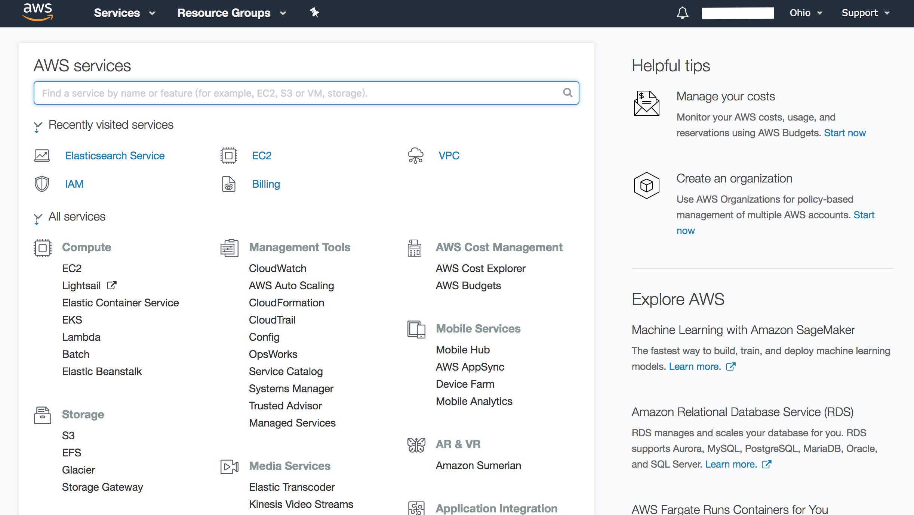

# AWS EC2建置教學

AWS EC2的全名為Amazon Elastic Compute Cloud，其以Web服務的方式，可讓使用者租用AWS雲端電腦系統，彈性地運行Amazon虛擬機器映像檔，使用者可以在這個虛擬機器上自由運用該系統。其優點便是在於非常地彈性，使用者可以隨時創建、終止、執行該虛擬機器，並採用量付費。

那麼一樣話不多說，讓我們直接開始創建AWS EC2吧。

## AWS EC2 建置

### Step1 進入AWS EC2 Service

進入Amazon Dashboard，並點選EC2進入。




### Step 2 創建EC2 Instance

首先先點選Running Instances，你會看到以下介面，接著點選Launch Instance。


### Step 3 選擇虛擬機器映像檔

在這邊你可以看到有很多很多的映像檔，那麼就依你自己的喜好去做選擇吧～在這邊我們選擇的是「Amazon Linux 2 AMI \(HVM\), SSD Volume Type 」

### Step 4 選擇虛擬實例類型

一樣也是依你的需求去選，那麼在這邊我們當然也一樣選擇免費的XD。


### Step 5 進階設定

#### Sub-step 1 進階配置

選擇完虛擬實例類型後點選「Next：Configure Instance Details」，你會看到以下介面，選擇所建立的IAM role，並選擇「Next:Add Storage」。


#### Sub-step 2 容量配置

接著選擇你要賦予該虛擬機器多少容量與其他相關配置，這個一樣是依照個人的需求去定，當訂定好了後點選「Next：Add Tags」。


#### Sub-step 3 標籤配置

接著便是為你的虛擬機器加上Tags，方便識別，請先點選Add Tags，接著Key的位置請填寫Name，Value則填寫你要對該虛擬機命名的名字。配置完後，點選「Next：Configure Security Group」。


#### Sub-step 4 安全組配置

這步很重要，會取決於有哪些IP可以對此EC2虛擬機進行訪問，且除此之外亦要能夠讓我們可以透過該虛擬機器所建立的反向代理伺服器來訪問Kibana。

那麼在這邊我們所配置的有

* SSH ： 你希望可以連上此EC2 Instance的IP網段，你可以透過mask來讓同一網域的人皆可連上。
* HTTP：將Source改為Anywhere
* HTTPS：將Source改為Anywhere


> 在此次建立後，AWS就會將這個security group記憶起來，下次若要創建其他EC2 Instance時，可選擇上圖中的Select an existing security group選項來進行選擇。

### Step 6 創建Key-pair

當我們都配置完並要launch instance時，便會出現下圖，這時便是輸入key pair名稱，並記得下載Key Pair檔案，其為一個\*.pem檔，我們必須透過該檔來連接EC2 Instance。


那麼到這邊我們就已經完成了EC2 Instance的建置。

## AWS EC2 連接

當我們創建好AWS EC2 Instance後，那麼我們又該如何進行連接呢？  
以下我們分為Unix-like和Windows系統去說

### Unix-like

#### Step 1

於終端機輸入:

```text
$ chmod 400 your_user_name-key-pair-region_name.pem
# 請先cd至你的*.pem目錄位置
```

此目的為設置私有密鑰的權限，確保只有你可以讀取

#### Step 2

於終端機輸入以下指令即可連線：

```text
$ ssh -i your_user_name-key-pair-region_name.pem Public DNS(IPv4) 以目前設置為例輸入:ssh -i "Joangae-key-pair-useast2.pem" ec2-user@ec2-52-14-97-41.us-east-2.compute.amazonaws.com
# 請先cd至你的*.pem目錄位置
# Public DNS(IPv4)會在你的實例創建完後會出現在Instance Dashboard上
```

### Windows

#### Step 1

安裝putty：[https://www.putty.org/](https://www.putty.org/)

#### Step 2

開啟PuTTYgen，點選load並選密鑰對pem檔，然後點選Save private key產生對應ppk檔\(注意:檔名須和密鑰對檔名一樣\)

#### Step 3

開啟Putty，於Host Name輸入:ec2-user@ec2 instance的Pubilc DNS\(IPv4\)

> 注意：因本Elasticsearch的地區設在Ohio，因此上述指令為ec2-user，若為其他地區請參閱AWS官方文件

#### Step 4

在Putty的左邊導覽行中展開SSH並點選Auth。

#### Step 5

Browse剛剛所產生出的ppk檔，完成後點選Open即可與其連線。

## AWS 彈性IP配置

剛剛在最初有提到AWS EC2 Instance可以隨時建立、終止、連線，非常方便。但就是因為太方便，導致若是我們重新建立一個AWS EC2 Instance，其IP位址便會改變，那麼其他服務連接原本的EC2 Instance就要再改他們的配置檔，導致不必要的麻煩。

基於上述的問題，AWS亦有提供彈性IP的配置，使即便我們要重新建立一個EC2 Instance，新的可以取代舊的EC2 Instance來使用同一個IP。 

> 注意：一個彈性IP只能對應一個EC2 Instance，因此若是新的要用的話，必須先將彈性IP和舊的Instance切開連結。

好了，那接下來讓我們看看要如何配置彈性IP吧。

### Step 1 創建彈性IP

至EC2 儀表板的左側導覽欄中點選Elastic IP，會出現以下介面，然後選擇Allocate new address，然後接下來就是一直下一步即可創建完成。


### Step 2 連結EC2 Instance

當創建完成後，就可以看到所新建的彈性IP，這時勾選他並點選Actions，便會出現下拉式選單。


#### 點選Associate address

在剛剛的下拉式選單點選Associate address後，選擇所要連結的EC2 Instance，並點選Associate即可完成連結。  
但要注意的是，若選擇連結，則該原EC2 Instance的public IP會被釋放並被該彈性IP取代。


#### 點選Release addresses

在剛剛的下拉式選單點選Release addresses後，會跳出一個視窗，接著再選擇Release即可釋出。

