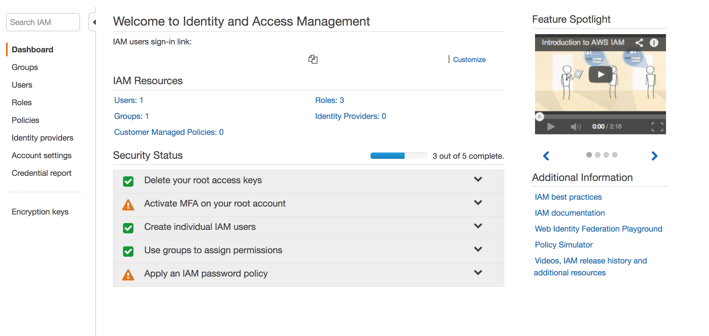
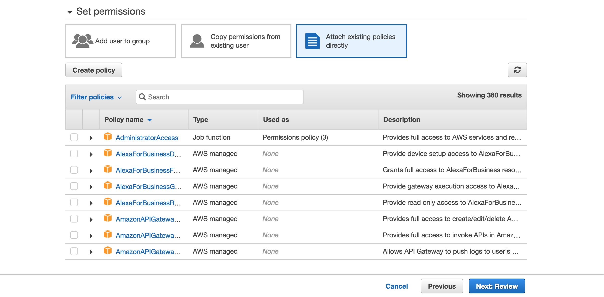
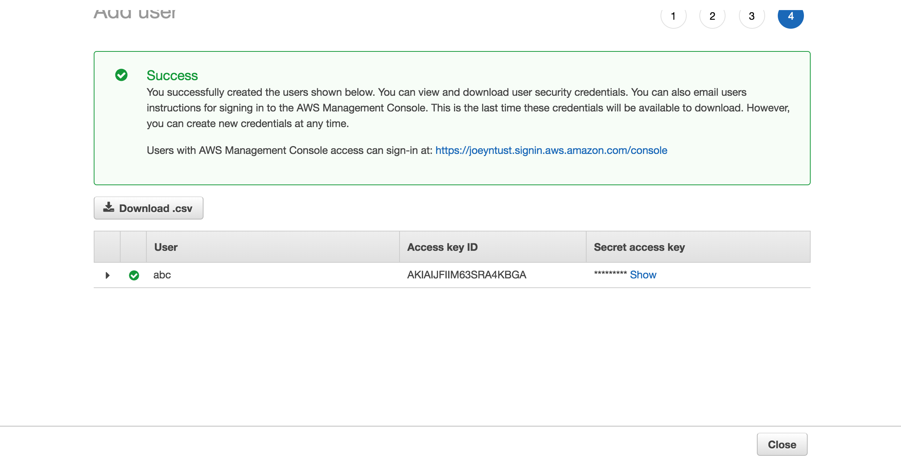
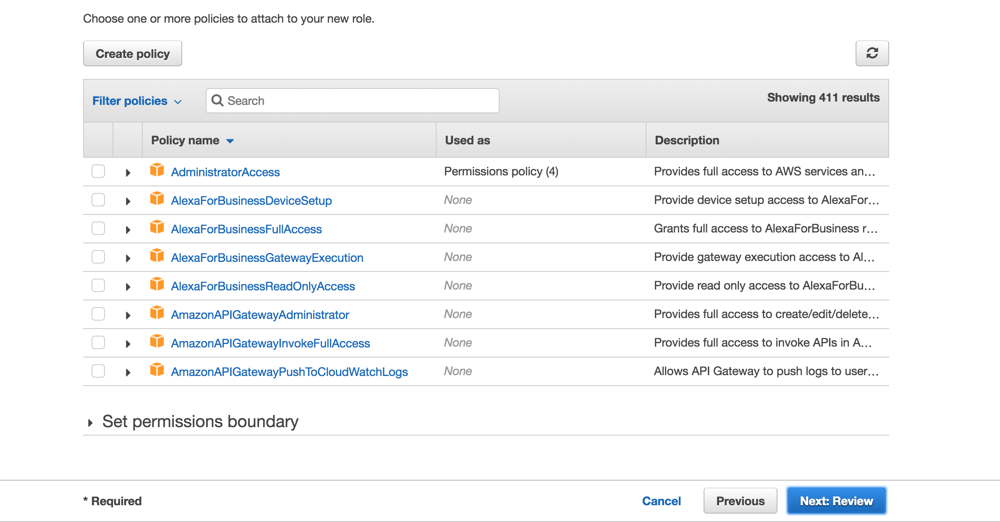
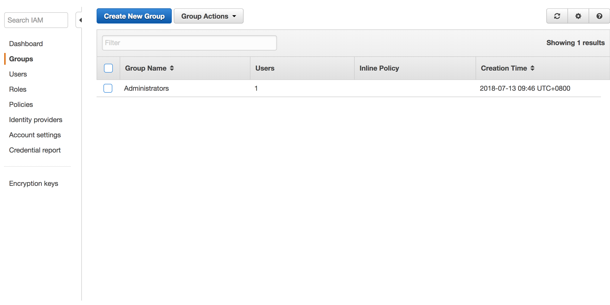

# AWS IAM 建置教學

AWS IAM\(Identity and Access Management\)是一種可以讓管理者輕鬆管理多個AWS使用者的服務，管控不同群集的人各自擁有哪些權限，以穩定系統與提昇安全性與結構性。

首先，請先移至到你的AWS 服務Dashboard，並點選IAM服務，然後你就會看到以下的介面。

AWS IAM服務最主要可以分為Users、Roles與Groups，接下來就讓我來帶大家如何創建這些東西。

## AWS Users創建

#### Step 1 

點選左側導覽欄的Users進入，並點選 Add users。  
接著再輸入user的名字，記得**Programmatic access**必須打勾。

#### Step 2

接下來除非你已創建好Group，而點選Add user to group來直接指定此使用者屬於該Group，令所創建的角色擁有該Group的權限外。亦或是複製另一個user的權限過來，否則我們必須點選Attach existing policies directly，並勾選我們所要賦予該角色的權限。 

#### Step 3

當都建置完畢並創建好user後，就會出現以下介面，這時千萬必須注意Access key ID與 Secret access key一定要保存起來，因為之後就不會有機會再讓你取得了。

## IAM Roles創建

#### Step 1

從IAM Dashboard的左側導覽欄中點選roles，會出現以下介面，並點選Create role來進行創建。

#### Step 2

在這裡必須要指定哪些AWS 服務需要使用到此role，那麼搭配AWS EC2的建置教學，我們在這邊選擇EC2。

#### Step 3

當點選下一步，接下來就是去勾選這個role可以擁有哪些權限並進行勾選，最後一直點選Next就可完成Role的建置。

## AWS Groups創建

當使用者很多時，若一個一個創建總是不切實際，這時我們就可以透過Groups來快速進行配置。其概念是，若有一群人都擁有同一組權限，這時我們即可創建出一個Group，然後將這些人家加進這個Group，該Group可以擁有的權限就是這些人可以有的權限。

#### Step 1

創建方法一樣是在IAM Dashboard的左邊導覽欄中點選Groups，並點擊Create New Group。

