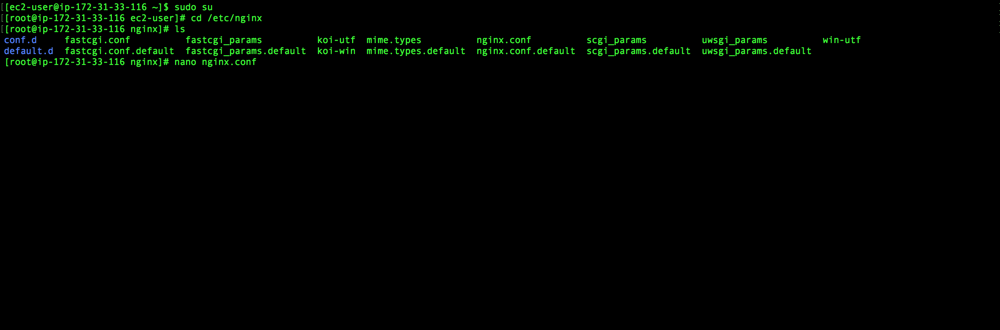

# 透過AWS EC2與Nginx創建反向代理伺服器進行訪問...

### 透過AWS EC2與Nginx創建反向代理伺服器進行訪問...

由上面這個小標題可以很明顯看出我們需要使用到AWS EC2的服務資源，所以我們當然也要先創建一個我們的AWS EC2虛擬機，以下為教學傳送門。 

* [AWS EC2 建置教學](aws-ec2.md)

我們的目標應為在該虛擬機中，透過Nginx來創建反向代理伺服器，並一樣透過SIGN 4簽署協議來對AWS Elasticsearch進行訪問。

好了一樣話不多說，讓我們直接教大家如建置並連接吧～

## Step 1 連結EC2

至於連結的方式在[AWS EC2 建置教學](aws-ec2.md) 中有提供，大家可以去看看，那麼若連結上我們就可以看到以下的介面。


> 因為我們在AWS EC2的建置教學中，我們建置的虛擬機系統Amazon Linux 2 AMI，所以是Linux的系統。

## Step 2 安裝Nginx

Amazon Linux 2預設便有提供一個下載工具包，而Nginx便是其中一個可以直接下載的資源庫，大大提升了安全性。

你可輸入以下指令來查看Amazon Linux 2提供哪些包可直接下載。

```text
$ amazon-linux-extras list
```


可以看到上方的列表的第四項即為nginx1.12，因此我們可以輸入以下指令來進行Nginx的安裝。

```text
$ sudo amazon-linux-extras install nginx1.12
```


## Step 3 配置Nginx

安裝好Nginx後，我們就可以開始配置Nginx來建構反向代理伺服器，並以Sign4協議來訪問AWS Kibana。

但首先，先讓我們切換至root管理者權限，因為需要改動到系統的配置。

```text
$ sudo su
```

接著，cd 至 /etc/nginx，並開啟nginx.conf進行編寫，你可使用vim或nano等文字編輯器。



nginx.conf配置資料如下：

```text
worker_processes auto;
error_log /var/log/nginx/error.log;
pid /var/run/nginx.pid;
include /usr/share/nginx/modules/*.conf;

events {
    worker_connections 1024;
}

http {
    log_format  main  '$remote_addr - $remote_user [$time_local] "$request" '
                      '$status $body_bytes_sent "$http_referer" '
                      '"$http_user_agent" "$http_x_forwarded_for"';

    access_log  /var/log/nginx/access.log  main;

    sendfile            on;
    tcp_nopush          on;
    tcp_nodelay         on;
    keepalive_timeout   65;
    types_hash_max_size 2048;
    include             /etc/nginx/mime.types;
    default_type        application/octet-stream;

    include /etc/nginx/conf.d/*.conf;
    index index.html index.htm;

    server {
      listen 80 default_server;
      listen [::]:80 default_server ipv6only=on;
      server_name _;

      location / {
        auth_basic "Username and Password are required";
        auth_basic_user_file /etc/nginx/.htpasswd;
        proxy_set_header Host [Your Elasticsearch domain];
        proxy_set_header X-Real-IP [Your Access IP];
        proxy_http_version 1.1;
        proxy_set_header Connection "Keep-Alive";
        proxy_set_header Proxy-Connection "Keep-Alive";
        proxy_set_header Authorization "";

        proxy_pass [https://Your Elasticsearch Domain];

      }

      location /kibana {
        auth_basic "Username and Password are required";
        auth_basic_user_file /etc/nginx/.htpasswd;
        proxy_set_header Host [Your Elasticsearch Domain];
        proxy_set_header X-Real-IP [Your Access IP];
        
        proxy_http_version 1.1;
        proxy_set_header Connection "Keep-Alive";
        proxy_set_header Proxy-Connection "Keep-Alive";
        proxy_set_header Authorization "";

        proxy_pass [https://Your Elasticsearch Domain/_plugin/kibana/];
        proxy_redirect [https://Your Elasticsearch Domain/_plugin/kibana/] [http://Elastic IP/kibana/];

      }

  }

}

```

