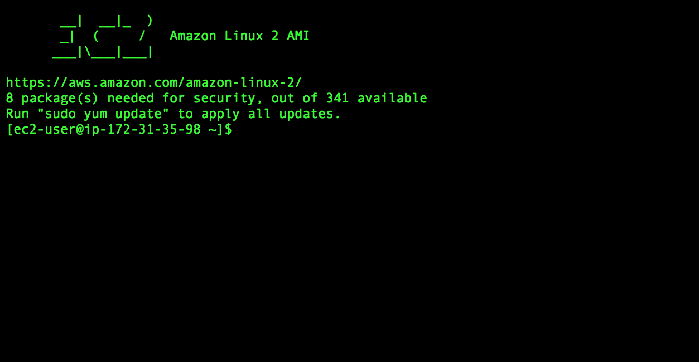
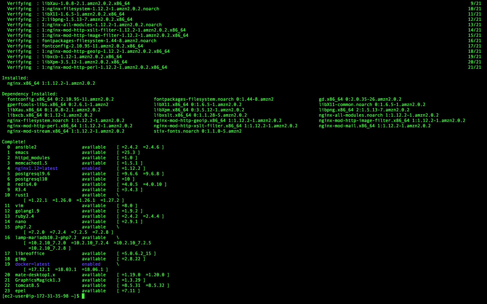

# 透過AWS EC2與Nginx創建反向代理伺服器進行訪問...

### 透過AWS EC2與Nginx創建反向代理伺服器進行訪問...

由上面這個小標題可以很明顯看出我們需要使用到AWS EC2的服務資源，所以我們當然也要先創建一個我們的AWS EC2虛擬機，以下為教學傳送門。 

* [AWS EC2 建置教學](aws-ec2.md)

我們的目標應為在該虛擬機中，透過Nginx來創建反向代理伺服器，並一樣透過SIGN 4簽署協議來對AWS Elasticsearch進行訪問。

好了一樣話不多說，讓我們直接教大家如建置並連接吧～

## Step 1 連結EC2

至於連結的方式在[AWS EC2 建置教學](aws-ec2.md) 中有提供，大家可以去看看，那麼若連結上我們就可以看到以下的介面。



> 因為我們在AWS EC2的建置教學中，我們建置的虛擬機系統Amazon Linux 2 AMI，所以是Linux的系統。

## Step 2 安裝Nginx

Amazon Linux 2預設便有提供一個下載工具包，而Nginx便是其中一個可以直接下載的資源庫，大大提升了安全性。

你可輸入以下指令來查看Amazon Linux 2提供哪些包可直接下載。

```text
$ amazon-linux-extras lista
```


可以看到上方的列表的第四項即為nginx1.12，因此我們可以輸入以下指令來進行Nginx的安裝。

```text
$ sudo amazon-linux-extras install nginx1.12
```



